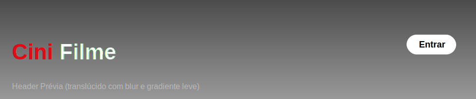
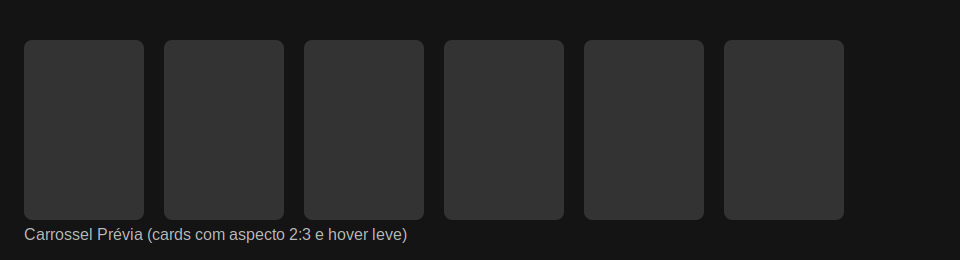

# Guia CSS do Projeto CiniFilme

Este guia foi expandido com explicações didáticas, contexto de uso e exemplos práticos para iniciantes. A ideia é que você entenda não só o “como”, mas também o “porquê” de cada escolha de estilo do projeto CiniFilme.

## Índice
- [Sintaxe Básica](#sintaxe-básica)
- [Seletores Usados](#seletores-usados)
- [Variáveis e Tema](#variáveis-e-tema)
- [Áreas Principais do CSS](#áreas-principais-do-css)
  - [Container](#container)
  - [Site Header](#site-header)
  - [Hero (Capa)](#hero-capa)
  - [Carrossel](#carrossel)
  - [Movie Card e Imagens](#movie-card-e-imagens)
  - [Promo Section / Banner](#promo-section--banner)
  - [Footer](#footer)
- [Animações e Acessibilidade](#animações-e-acessibilidade)
- [Responsividade](#responsividade)
- [Boas Práticas de Organização](#boas-práticas-de-organização)
- [Exemplos Rápidos](#exemplos-rápidos)
- [Exercícios Práticos (para fixar)](#exercícios-práticos-para-fixar)
- [Exemplos com Screenshots](#exemplos-com-screenshots)
- [Checklist de Revisão CSS](#checklist-de-revisão-css)

## Sintaxe Básica
Como funciona: um bloco CSS segue `seletor { propriedade: valor; }`. O seletor escolhe o(s) elemento(s) e cada declaração altera sua aparência.

- Unidades comuns: `px` (fixo), `rem` (relativo à fonte raiz), `%` (proporcional ao pai), `vw/vh` (proporcional à janela), `dvw/dvh` (viewport dinâmico, melhor em mobile moderno).
- Especificidade: `#id` > `.classe` > `elemento`. Prefira classes para manter controle e reduzir conflitos.
- Ordem e cascata: se duas regras atingirem o mesmo elemento, vence a mais específica; se empatar, vale a regra que aparece por último.
- Comentários: comente regras não óbvias e agrupe por componente para facilitar manutenção.

Exemplos:
```css
img { display: block; }                  /* seletor de elemento */
.botao { background: #e50914; }          /* seletor de classe */
.header .botao { margin-left: 12px; }    /* combinador descendente */
```

## Seletores Usados
- Classe (`.classe`): principal forma de estilizar blocos reutilizáveis (ex.: `.hero`, `.carousel`, `.movie-card`).
- ID (`#id`): evite para estilo; útil para âncoras ou JS.
- Elemento (`img`, `button`, `h1`): bom para resetar regras base.

Combinadores e utilidades:
- Descendente: `.carousel .movie-card` aplica no card dentro do carrossel.
- Filho direto: `.carousel > .movie-card` aplica somente se for filho direto.
- Irmão adjacente: `.title + .subtitle` pega o elemento logo após.

Pseudo-classes e pseudo-elementos:
- Estados: `:hover`, `:focus`, `:active`, `:disabled`, `:focus-visible` (ótimo para acessibilidade por teclado).
- Pseudo-elementos: `::before` e `::after` adicionam conteúdo decorativo sem HTML extra.

Seletores modernos:
- `:is(.a, .b)`: reduz repetição e especificidade.
- `:where(.a, .b)`: como `:is`, mas zera a especificidade (bom para resets).
- `:not(.classe)`: aplica quando um elemento não tem determinada classe.

## Variáveis e Tema
Custom properties (variáveis CSS) ficam no `:root` para uso global. Elas trazem consistência, facilitam manutenção e permitem temas.
```css
:root {
  --bg-primary: #141414;
  --bg-secondary: #181818;
  --text-primary: #ffffff;
  --text-secondary: #b3b3b3;
  --accent-color: #e50914; /* vermelho base do destaque */
  --border-radius: 8px;
}
```
Uso e boas práticas:
- Aplicar: `color: var(--text-primary);`
- Fallback: `color: var(--text-secondary, #b3b3b3);`
- Temas dinâmicos: altere variáveis em uma classe do `body` para trocar tema claro/escuro.
- `currentColor`: algumas propriedades podem herdar a cor corrente do texto do elemento.

## Áreas Principais do CSS
Esta seção descreve os principais blocos do projeto e por que estão configurados assim.

### Container
Objetivo: limitar largura e centralizar conteúdo.
```css
.container {
  max-width: 1200px;
  margin: 0 auto;
  padding: 0 2rem;
}
```

### Site Header
Topo translúcido com blur, logo à esquerda e ações à direita. Mantemos `position: fixed` e `z-index` alto para ficar sempre visível.
```css
.site-header {
  position: fixed; inset: 0 0 auto 0;
  display: flex; justify-content: space-between; align-items: center;
  padding: 0.75rem 1rem;
  background: linear-gradient(180deg, rgba(0,0,0,.55), rgba(0,0,0,.35));
  backdrop-filter: saturate(140%) blur(12px);
  z-index: 1000;
}
```
Boas práticas: garantir contraste do texto e foco visível nos botões.

### Hero (Capa)
Altura em tela cheia e imagem cobrindo toda a área para impacto visual. Usamos `object-fit: cover` e um gradiente para legibilidade.
```css
.hero { height: 100dvh; min-height: 700px; position: relative; }
.hero-image { width: 100%; height: 100%; object-fit: cover; object-position: center; }
.hero-gradient {
  position: absolute; inset: 0;
  background: linear-gradient(180deg, rgba(0,0,0,.35) 0%, rgba(0,0,0,.7) 70%, rgba(0,0,0,.85) 100%);
}
.hero-content {
  position: absolute; inset: auto 0 12%; padding: 0 2rem; color: #fff;
}
```

### Carrossel
Cards em linha com navegação. Podemos usar `flex`/`grid` e transições suaves.
```css
.carousel { display: flex; gap: 1rem; overflow: hidden; }
.carousel .movie-card { flex: 0 0 180px; }
```

### Movie Card e Imagens
Proporção consistente para posters e feedback visual no hover.
```css
.movie-card { aspect-ratio: 2/3; border-radius: var(--border-radius); overflow: hidden; }
.movie-image { width: 100%; height: 100%; object-fit: cover; }
.movie-card:hover { transform: translateY(-2px); transition: transform 160ms ease; }
```

### Promo Section / Banner
Fundo dinâmico com animação leve. Fornecemos alternativa para reduzir movimento.
```css
@keyframes promoScroll {
  0% { background-position: 0 0; }
  100% { background-position: 100% 0; }
}
.promo-banner { animation: promoScroll 30s linear infinite; }
@media (prefers-reduced-motion: reduce) {
  .promo-banner { animation-duration: 0.01ms; animation-iteration-count: 1; }
}
```

### Footer
Grade simples e tipografia menor; mantenha contraste e foco visível.
```css
footer { color: var(--text-secondary); font-size: 0.9rem; }
footer a { color: var(--text-primary); }
footer a:focus-visible { outline: 3px solid rgba(255,255,255,.6); outline-offset: 2px; }
```

## Animações e Acessibilidade
- `@keyframes`: movimentos leves para banners, fades ou deslocamentos pequenos.
- `transition`: responda ao `hover`/`focus` com duração curta (150–250ms).
- `prefers-reduced-motion`: respeite quem prefere menos movimento, desativando ou reduzindo animações.
- Foco por teclado: use `:focus-visible` e evite remover outline sem alternativa visível.
- Contraste: texto deve ter contraste suficiente com o fundo (ideal ≥ 4.5:1).

Exemplo de foco acessível:
```css
.btn:focus-visible { outline: 3px solid rgba(229,9,20,.6); outline-offset: 2px; }
```

## Responsividade
- Breakpoints: `768px` e `480px` cobrem boa parte de mobile e tablets.
- Tipografia fluida com `clamp()`: define mínimo, faixa fluida e máximo.
- Altura da capa: `100vh` pode “contar” barras no mobile; `100dvh` considera viewport real.
- Imagens: `object-fit: cover` para preencher; `contain` para evitar cortes (com faixas). Ajuste `object-position` para “enquadrar” a parte importante.
- Proporção de cards: `aspect-ratio` dá consistência visual.

Exemplos:
```css
@media (max-width: 768px) {
  .site-header { padding: 0.5rem 0.75rem; }
  .hero-content { inset: auto 0 10%; padding: 0 1rem; }
}
@media (max-width: 480px) {
  .movie-card { flex: 0 0 140px; }
}

.title { font-size: clamp(1.25rem, 2.5vw, 2rem); }
```

## Boas Práticas de Organização
- Nomenclatura clara: `hero-slide`, `btn-primary`, `movie-card`.
- Componentização: agrupe regras por componente; comente decisões importantes.
- Evite “números mágicos”: use variáveis e `clamp()`.
- Especificidade baixa: prefira classes simples; use `:where()` para resets sem elevar força.
- Camadas e z-index: defina stacking claro (header acima da hero; gradiente sobre a imagem; conteúdo acima do gradiente).
- Performance: imagens com tamanhos adequados (TMDB: `w780`/`w1280`), `loading: lazy` nas imagens; evite sombras muito pesadas em listas longas.

## Exemplos Rápidos
Botão primário acessível:
```css
.btn-primary {
  background: var(--accent-color);
  color: #fff;
  border-radius: var(--border-radius);
  padding: 0.625rem 1rem;
  font-weight: 600;
  transition: transform 160ms ease, box-shadow 160ms ease;
  box-shadow: 0 6px 16px rgba(229, 9, 20, 0.35);
}
.btn-primary:hover { transform: translateY(-1px); }
.btn-primary:focus-visible { outline: 3px solid rgba(229,9,20,.6); outline-offset: 2px; }
```

Imagem da capa cobrindo com legibilidade:
```css
.hero { height: 100dvh; min-height: 700px; position: relative; }
.hero-image { width: 100%; height: 100%; object-fit: cover; object-position: center; }
.hero-gradient {
  position: absolute; inset: 0;
  background: linear-gradient(180deg, rgba(0,0,0,.35) 0%, rgba(0,0,0,.7) 70%, rgba(0,0,0,.85) 100%);
}
.hero-content { position: absolute; inset: auto 0 12%; padding: 0 2rem; color: #fff; }
```

Header translúcido fixo:
```css
.site-header {
  position: fixed; inset: 0 0 auto 0;
  display: flex; justify-content: space-between; align-items: center;
  padding: 0.75rem 1rem;
  background: linear-gradient(180deg, rgba(0,0,0,.55), rgba(0,0,0,.35));
  backdrop-filter: saturate(140%) blur(12px);
  z-index: 1000;
}
```

## Exercícios Práticos (para fixar)
- Troque o `--accent-color` no `:root` e veja o tema acompanhar.
- Ajuste `object-position` da `.hero-image` para `top center` e observe o enquadramento.
- Adicione `aspect-ratio: 2 / 3` em `.movie-card` e verifique cards mais consistentes.
- Crie um `@media (max-width: 480px)` e reduza o `padding` do header para melhorar em telas pequenas.

## Exemplos com Screenshots
Para dar referência visual rápida, abaixo há prévias ilustrativas (SVG) dos principais blocos. Substitua pelos seus próprios screenshots depois.

### Header (Topo)


### Hero (Capa)


### Carrossel (Cards)


Para capturar screenshots reais:
- Rode o projeto localmente e abra em tela cheia.
- Use a ferramenta de captura do sistema ou DevTools (Ctrl+Shift+P → “Capture screenshot”).
- Salve em `Projeto_Iniciante/screenshots/`, por exemplo: `header.png`, `hero.png`, `carousel.png` e atualize os links acima.

## Checklist de Revisão CSS
- Contraste: texto legível em todos os fundos (≥ 4.5:1).
- Foco: `:focus-visible` presente nos elementos interativos.
- Movimento: `prefers-reduced-motion` implementado nas principais animações.
- Responsividade: verifique em 480px, 768px e telas grandes.
- Imagens: `object-fit` e `object-position` corretos; use tamanhos TMDB adequados (`w780`/`w1280`).
- Tipografia: use `clamp()` onde faz sentido; evite `px` fixo para textos.
- Overflows: checar se carrosséis e hero não geram barras indesejadas.
- Camadas: header nunca deve ficar coberto; gradiente acima da imagem; conteúdo acima do gradiente.
- Performance: imagens lazy, sombras moderadas, sem transições pesadas em listas.