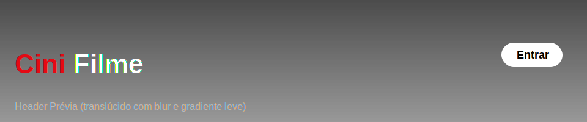
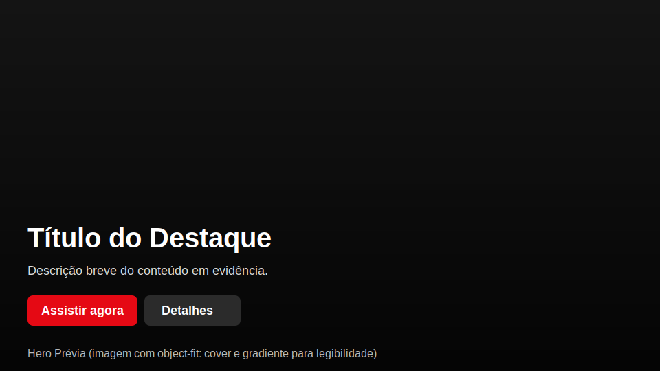
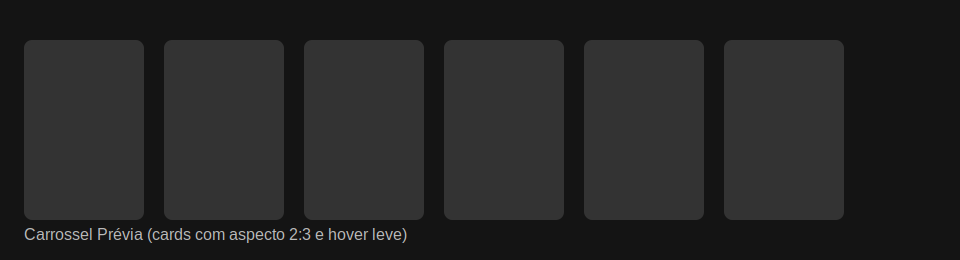

# Guia HTML do Projeto CiniFilme

Documento acadêmico e didático para iniciantes em desenvolvimento de sites. Explica a estrutura HTML, a semântica e a acessibilidade usadas no projeto CiniFilme, com exemplos práticos e boas práticas para você criar páginas bem organizadas e fáceis de manter.

## Índice
- [Introdução](#introdução)
- [O que é HTML](#o-que-é-html)
- [Estrutura do Documento](#estrutura-do-documento)
- [Metadados e Cabeçalho (`<head>`)](#metadados-e-cabeçalho-head)
- [Organização Semântica e Landmarks](#organização-semântica-e-landmarks)
- [Tipografia e Títulos (H1–H6)](#tipografia-e-títulos-h1h6)
- [Imagens e Mídia](#imagens-e-mídia)
- [Links e Navegação](#links-e-navegação)
- [Listas](#listas)
- [Tabelas (quando usar)](#tabelas-quando-usar)
- [Formulários (básico)](#formulários-básico)
- [Componentes do Projeto CiniFilme](#componentes-do-projeto-cinifilme)
  - [Cabeçalho (Header)](#cabeçalho-header)
  - [Capa (Hero)](#capa-hero)
  - [Carrosséis](#carrosséis)
  - [Seção Promocional](#seção-promocional)
  - [Rodapé (Footer)](#rodapé-footer)
- [Acessibilidade](#acessibilidade)
- [Boas Práticas](#boas-práticas)
- [SEO e Metadados Sociais](#seo-e-metadados-sociais)
- [Exemplos Práticos](#exemplos-práticos)
  - [Estrutura Base Comentada](#estrutura-base-comentada)
  - [Adicionar um Slide à Capa](#adicionar-um-slide-à-capa)
  - [Card de Carrossel](#card-de-carrossel)
  - [Markup do Modal TMDB (exemplo)](#markup-do-modal-tmdb-exemplo)
- [Exercícios](#exercícios)
- [Validação e Ferramentas](#validação-e-ferramentas)
- [Perguntas Frequentes](#perguntas-frequentes)
- [Referências Visuais (Screenshots)](#referências-visuais-screenshots)
- [Checklist Final](#checklist-final)

## Introdução
HTML (HyperText Markup Language) é a linguagem de marcação que estrutura o conteúdo de páginas web. Este guia foca em HTML semântico, acessibilidade e organização, usando o projeto CiniFilme como exemplo prático.

## O que é HTML
- Marca o conteúdo com tags: títulos, parágrafos, imagens, links, seções.
- Define hierarquia e significado semântico para leitores, buscadores e tecnologias assistivas.
- Trabalha junto com CSS (estilos) e JavaScript (comportamento).

## Estrutura do Documento
Elementos essenciais:
- `<!DOCTYPE html>`: indica documento HTML5.
- `<html lang="pt-br">`: define idioma (melhora acessibilidade e SEO).
- `<head>`: metadados, título e importação de CSS.
- `<body>`: conteúdo visível da página.

Dica: sempre mantenha indentação e comentários claros para facilitar manutenção.

## Metadados e Cabeçalho (`<head>`)
- `<meta charset="UTF-8">`: codificação de caracteres.
- `<meta name="viewport" content="width=device-width, initial-scale=1.0">`: responsividade.
- `<title>`: título da aba/navegador.
- `<link rel="stylesheet" href="index.css">`: importa estilos.
- Extras úteis: favicon, Open Graph, `meta description`.

## Organização Semântica e Landmarks
Use elementos semânticos para criar “pontos de referência” (landmarks):
- `<header role="banner">`: topo da página.
- `<nav>`: navegação.
- `<main>`: conteúdo principal (apenas um por página).
- `<section>`: áreas temáticas.
- `<footer>`: rodapé.

No projeto, usamos classes e `role` para manter compatibilidade com o CSS atual. Você pode migrar gradualmente para tags semânticas.

## Tipografia e Títulos (H1–H6)
- Use um único `h1` por página para o título principal.
- Estruture subseções com `h2`, `h3` etc. Evite pular níveis sem necessidade.
- Títulos devem descrever claramente o conteúdo que apresentam.

## Imagens e Mídia
- Sempre inclua `alt` descritivo em imagens.
- Use `loading="lazy"` em imagens abaixo da dobra para performance.
- Para imagens de fundo controladas por CSS, garanta contraste e legibilidade do texto (gradientes ajudam).

## Links e Navegação
- Use `<a href="...">` com texto claro.
- Em navegações, agrupe links dentro de `<nav>`.
- Para acessibilidade, o link deve indicar para onde leva ou que ação realiza.

## Listas
- `ul` (não ordenadas) e `ol` (ordenadas) organizam itens.
- Use `li` para cada item. Evite listas longas sem agrupamento.

## Tabelas (quando usar)
- Use `<table>` apenas para dados tabulares.
- Inclua `<caption>`, `<thead>`, `<tbody>`, `<th>` para estrutura e significado.

## Formulários (básico)
- Cada `<input>` deve ter um `<label>` visível ou ligado via `for`/`id`.
- Use `type` correto (`email`, `number`, `password` etc.).
- Agrupe campos relacionados com `<fieldset>` e `<legend>` quando fizer sentido.

## Componentes do Projeto CiniFilme
Abaixo, a estrutura dos principais blocos da página.

### Cabeçalho (Header)
Topo com logotipo e ações (Entrar e Configurar TMDB). No projeto:
```html
<div class="site-header" role="banner" aria-label="Cabeçalho">
  <a href="#" class="brand-logo" aria-label="CiniFilme - Página inicial">
    <span class="brand-part brand-part-cini">Cini</span><span class="brand-part brand-part-filme">Filme</span>
  </a>
  <div class="header-actions">
    <button class="btn btn-login" aria-label="Entrar">Entrar</button>
    <button id="btn-open-settings" class="btn btn-secondary btn-settings" aria-haspopup="dialog" aria-controls="tmdb-settings-modal">
      Configurar TMDB
    </button>
  </div>
</div>
```
Boas práticas:
- `aria-label` no logo (link para início).
- `aria-haspopup="dialog"` e `aria-controls` no botão que abre modal.

### Capa (Hero)
Seção em destaque com imagem grande, gradiente e ações.
```html
<section class="hero has-capa" aria-label="Destaques">
  <nav class="hero-top-pill" aria-label="Atalhos">
    <a href="#mais-titulos" class="pill-link">Mais títulos</a>
    <span class="pill-sep" aria-hidden="true"></span>
    <a href="#planos" class="pill-link">Planos</a>
  </nav>
  <div class="hero-slider" id="hero-slider">
    <div class="hero-slide is-active" data-index="0">
      
      <div class="hero-gradient"></div>
      <div class="hero-content">
        <h2 class="hero-title">Título do destaque</h2>
        <p class="hero-description">Uma breve descrição do conteúdo.</p>
        <div class="hero-actions">
          <button class="btn btn-primary">Assistir agora</button>
          <button class="btn btn-secondary">Detalhes</button>
        </div>
      </div>
    </div>
  </div>
</section>
```

### Carrosséis
Listas horizontais de cards com navegação.
```html
<section class="section" id="mais-titulos" aria-label="Mais títulos">
  <h2 class="section-title">Populares</h2>
  <div class="carousel-wrapper">
    <button class="nav-button left" aria-label="Anterior">‹</button>
    <div class="carousel" id="carousel-popular"><!-- Cards gerados via JS --></div>
    <button class="nav-button right" aria-label="Próximo">›</button>
  </div>
</section>
```
Dica: os cards são criados em JS (veja `Guia_JS.md`).

### Seção Promocional
Bloco com fundo dinâmico populado via JS.
```html
<section class="promo-section" aria-label="Promoção">
  <div class="promo-banner">
    <div class="promo-bg" aria-hidden="true">
      <div class="promo-bg-strip"><!-- Imagens inseridas dinamicamente --></div>
    </div>
    <h3 class="promo-title">Assine e aproveite mais conteúdos</h3>
    <div class="promo-actions">
      <button class="btn btn-primary">Ver planos</button>
    </div>
  </div>
</section>
```

### Rodapé (Footer)
Área final da página para links e informações.
```html
<footer class="site-footer" aria-label="Rodapé">
  <!-- Conteúdo do rodapé -->
</footer>
```

## Acessibilidade
- Imagens com `alt` descritivo.
- Elementos interativos acessíveis via teclado (tabulação e foco visível).
- Uso de `aria-*` com propósito claro (ex.: `aria-label`, `aria-controls`, `aria-hidden`).
- Estrutura de títulos coerente.
- Landmarks ajudam leitores de tela a navegar.

## Boas Práticas
- Semântica: prefira `<header>`, `<main>`, `<section>`, `<footer>` quando possível.
- Hierarquia: mantenha uma ordem lógica de títulos e conteúdo.
- Comentários: explique trechos complexos.
- Modularidade: separe por seções/componentes.
- Performance: `loading="lazy"` em imagens e scripts deferidos quando possível.

## SEO e Metadados Sociais
- `title` e `meta description` claros.
- Open Graph (compartilhamento):
```html
<meta property="og:title" content="CiniFilme" />
<meta property="og:description" content="Descubra títulos populares e destaques." />
<meta property="og:image" content="URL_DA_CAPA_OU_LOGO" />
<meta property="og:type" content="website" />
```
- Favicon e canonical quando aplicável.

## Exemplos Práticos
### Estrutura Base Comentada
```html
<!DOCTYPE html>
<html lang="pt-br">
  <head>
    <meta charset="UTF-8" />
    <meta name="viewport" content="width=device-width, initial-scale=1.0" />
    <title>CiniFilme</title>
    <link rel="stylesheet" href="index.css" />
  </head>
  <body>
    <div class="container">
      <!-- Cabeçalho (logo + ações) -->
      <div class="site-header" role="banner" aria-label="Cabeçalho">
        <a href="#" class="brand-logo" aria-label="CiniFilme - Página inicial">
          <span class="brand-part brand-part-cini">Cini</span><span class="brand-part brand-part-filme">Filme</span>
        </a>
        <div class="header-actions">
          <button class="btn btn-login" aria-label="Entrar">Entrar</button>
          <button id="btn-open-settings" class="btn btn-secondary btn-settings" aria-haspopup="dialog" aria-controls="tmdb-settings-modal">
            Configurar TMDB
          </button>
        </div>
      </div>

      <!-- Capa (Hero) -->
      <section class="hero has-capa" aria-label="Destaques">
        <nav class="hero-top-pill" aria-label="Atalhos">
          <a href="#mais-titulos" class="pill-link">Mais títulos</a>
          <span class="pill-sep" aria-hidden="true"></span>
          <a href="#planos" class="pill-link">Planos</a>
        </nav>
        <div class="hero-slider" id="hero-slider"></div>
      </section>

      <!-- Seções de carrosséis -->
      <section class="section" id="mais-titulos" aria-label="Mais títulos">
        <h2 class="section-title">Populares</h2>
        <div class="carousel-wrapper">
          <button class="nav-button left" aria-label="Anterior">‹</button>
          <div class="carousel" id="carousel-popular"></div>
          <button class="nav-button right" aria-label="Próximo">›</button>
        </div>
      </section>

      <!-- Seção promocional -->
      <section class="promo-section" aria-label="Promoção">
        <div class="promo-banner">
          <div class="promo-bg" aria-hidden="true">
            <div class="promo-bg-strip"></div>
          </div>
          <h3 class="promo-title">Assine e aproveite mais conteúdos</h3>
          <div class="promo-actions">
            <button class="btn btn-primary">Ver planos</button>
          </div>
        </div>
      </section>

      <!-- Rodapé -->
      <footer class="site-footer" aria-label="Rodapé"></footer>
    </div>

    <!-- Scripts da página -->
    <script src="index.js"></script>
    <script src="promo-bg.js"></script>
  </body>
</html>
```

### Adicionar um Slide à Capa
```html
<div class="hero-slide" data-index="3">
  
  <div class="hero-gradient"></div>
  <div class="hero-content">
    <h2 class="hero-title">Exemplo</h2>
    <p class="hero-description">Descrição curta do destaque exibido.</p>
    <div class="hero-actions">
      <button class="btn btn-primary">Assistir agora</button>
      <button class="btn btn-secondary">Detalhes</button>
    </div>
  </div>
</div>
```

### Card de Carrossel
```html
<a class="movie-card" href="#" aria-label="Ver detalhes do título X">
  
</a>
```

### Markup do Modal TMDB (exemplo)
```html
<div id="tmdb-settings-modal" role="dialog" aria-modal="true" aria-labelledby="tmdb-modal-title" hidden>
  <div class="modal-content">
    <h2 id="tmdb-modal-title">Configurar TMDB</h2>
    <p>Informe sua API Key v3 para carregar dados reais.</p>
    <label for="tmdb-api-key">API Key</label>
    <input id="tmdb-api-key" name="tmdb-api-key" type="text" placeholder="api_key_aqui..." />
    <div class="modal-actions">
      <button class="btn btn-primary" id="save-tmdb-key">Salvar</button>
      <button class="btn btn-secondary" id="cancel-tmdb-key">Cancelar</button>
    </div>
  </div>
</div>
```

## Exercícios
- Adicione dois novos slides na capa e verifique se os `alt` estão descritivos.
- Crie uma nova seção com `h2` e uma lista de links dentro de `<nav>`.
- Inclua um pequeno formulário de contato com `<label>` e `aria-describedby` explicando os campos.

## Validação e Ferramentas
- Valide o HTML no W3C: https://validator.w3.org/
- Use Lighthouse (DevTools) para avaliar acessibilidade e SEO.
- Teste navegação por teclado (Tab/Shift+Tab) e leitores de tela.

## Perguntas Frequentes
- Posso usar `<div>` para tudo? Tecnicamente sim, mas semântica melhora acessibilidade, SEO e manutenção.
- Preciso de `alt` em todas imagens? Sim, exceto imagens puramente decorativas (use `alt=""`).
- Onde colocar scripts? No final do `body` ou com `defer` no `head` para não bloquear renderização.

## Referências Visuais (Screenshots)
- Header (prévia):


- Hero (prévia):


- Carrossel (prévia):


- Modal TMDB (prévia):


Atualize para imagens reais do seu projeto quando possível (`.png`), mantendo o diretório `Projeto_Iniciante/screenshots/`.

## Checklist Final
- Títulos: `h1` único, hierarquia clara (`h2`, `h3`...).
- Semântica: use landmarks (`header`, `nav`, `main`, `footer`) quando aplicável.
- Acessibilidade: `alt` descritivo, foco visível, `aria-*` correto.
- Navegação: links claros dentro de `<nav>`.
- Performance: `loading="lazy"` nas imagens; scripts não bloqueantes.
- Metadados: `title`, `description`, Open Graph (quando compartilhar).
- Estrutura limpa: indentação consistente, comentários úteis.