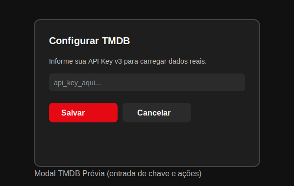

# Guia JS do Projeto CiniFilme

Este tutorial apresenta os conceitos básicos usados no JavaScript do projeto, explica os arquivos principais e mostra exemplos comentados para iniciantes. Também inclui um índice navegável e prévias ilustrativas para facilitar a visualização.

## Índice
- [Arquivos JavaScript](#arquivos-javascript)
- [Conceitos Básicos](#conceitos-básicos)
- [Fluxo Geral do `index.js`](#fluxo-geral-do-indexjs)
- [Exemplo: Criar um Card](#exemplo-criar-um-card)
- [Exemplo: Popular Hero (Capa)](#exemplo-popular-hero-capa)
- [Dicas de Depuração](#dicas-de-depuração)
- [Exemplo: Buscar dados do TMDB](#exemplo-buscar-dados-do-tmdb)
- [Exemplos com Screenshots](#exemplos-com-screenshots)

## Arquivos JavaScript
- `index.js`: lógica principal da página (carrosséis, capa/hero, modal TMDB, utilidades).
- `promo-bg.js`: preenche dinamicamente o fundo da seção promocional com imagens da capa/carrosséis (prioriza backdrops).
- `carousel.js`: comportamentos auxiliares de carrosséis (se usado).
- `footer.js`: lógica do rodapé (se aplicável).
- `data.js`: conjunto de dados local (fallback) para quando não há API Key do TMDB.

## Conceitos Básicos
- Variáveis: `const`, `let`.
- Funções: `function nome() { ... }` e arrow functions `() => { ... }`.
- Arrays/objetos: `.map`, `.forEach`, `.filter`.
- DOM: `document.querySelector`, `createElement`, `appendChild`.
- Eventos: `addEventListener('click', ...)`.
- Classes JS: usadas para componentes (ex.: `HeroSlider`).

## Fluxo Geral do `index.js`
1. Busca dados do TMDB se a API Key estiver configurada; caso contrário usa `data.js` como fallback.
2. Converte dados crus em formato amigável com `mapMedia` (extrai `poster` e `backdrop`).
3. Cria cartões com `buildCard(item)` e adiciona aos carrosséis.
4. Monta a capa (hero) e inicializa `HeroSlider` para alternar destaques.
5. Controla navegação/auto-play dos carrosséis.
6. Exibe modal para configurar a TMDB Key e salva em `localStorage`.

## Exemplo: Criar um Card (com comentários)
```js
function buildCard(item, sectionId) {
  const card = document.createElement('a');
  card.className = 'movie-card';
  card.href = '#';
  card.setAttribute('aria-label', `Ver detalhes de ${item.title || 'título'}`);

  const img = document.createElement('img');
  img.className = 'movie-image';
  img.src = item.poster || item.image;
  img.alt = `Poster de ${item.title || 'título'}`;
  img.loading = 'lazy';
  img.setAttribute('data-poster', item.poster || '');
  img.setAttribute('data-backdrop', item.backdrop || '');

  card.appendChild(img);
  return card;
}
```

## Exemplo: Popular Hero (Capa)
```js
const heroSliderEl = document.getElementById('hero-slider');
const slides = [
  { title: 'Filme A', image: 'https://image.tmdb.org/t/p/w1280/EXEMPLO.jpg', description: 'Resumo' },
];
slides.forEach((h, idx) => {
  const slide = document.createElement('div');
  slide.className = 'hero-slide' + (idx === 0 ? ' is-active' : '');
  slide.innerHTML = `
    
    <div class="hero-gradient"></div>
    <div class="hero-content">
      <h2 class="hero-title">${h.title}</h2>
      <p class="hero-description">${h.description || ''}</p>
      <div class="hero-actions">
        <button class="btn btn-primary">Assistir agora</button>
        <button class="btn btn-secondary">Detalhes</button>
      </div>
    </div>`;
  heroSliderEl.appendChild(slide);
});
```

## Dicas de Depuração
- Use `console.log(...)` para inspecionar valores.
- Abra DevTools (F12) → guia Network para ver chamadas à API.
- Verifique erros de CORS/ORB ao carregar imagens externas; se necessário, tente tamanhos `w780`/`w1280` e `referrerpolicy="no-referrer"` em imagens de fundo.
- Faça testes com movimento reduzido (`prefers-reduced-motion`).
- Comente trechos para isolar problemas e reativar gradualmente.

## Exemplo: Buscar dados do TMDB
```js
const API_KEY = localStorage.getItem('TMDB_API_KEY');
const BASE = 'https://api.themoviedb.org/3';
async function fetchPopularMovies() {
  const url = `${BASE}/movie/popular?api_key=${API_KEY}&language=pt-BR&page=1`;
  const res = await fetch(url);
  const json = await res.json();
  return json.results || [];
}
```

## Exemplos com Screenshots
Para ajudar a visualizar como o JS se conecta à UI, seguem prévias ilustrativas dos elementos que o código cria/manipula.

### Modal TMDB


### Hero (Capa) e Carrosséis
Estas partes são montadas e atualizadas via JS. Consulte também as prévias do CSS:
- [Header Prévia](./screenshots/header-preview.svg)
- [Hero Prévia](./screenshots/hero-preview.svg)
- [Carrossel Prévia](./screenshots/carousel-preview.svg)

Para screenshots reais:
- Inicie o projeto e acione o modal “Configurar TMDB”.
- Capture a tela e salve em `Projeto_Iniciante/screenshots/` (ex.: `modal.png`).
- Substitua os SVGs de exemplo pelos seus arquivos reais.